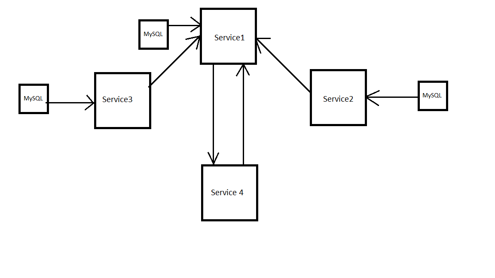
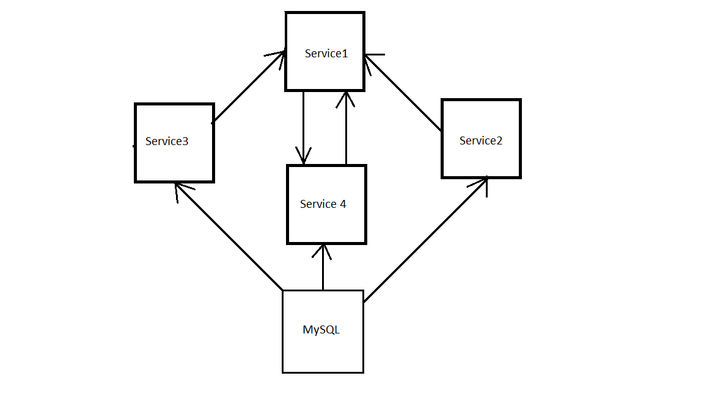
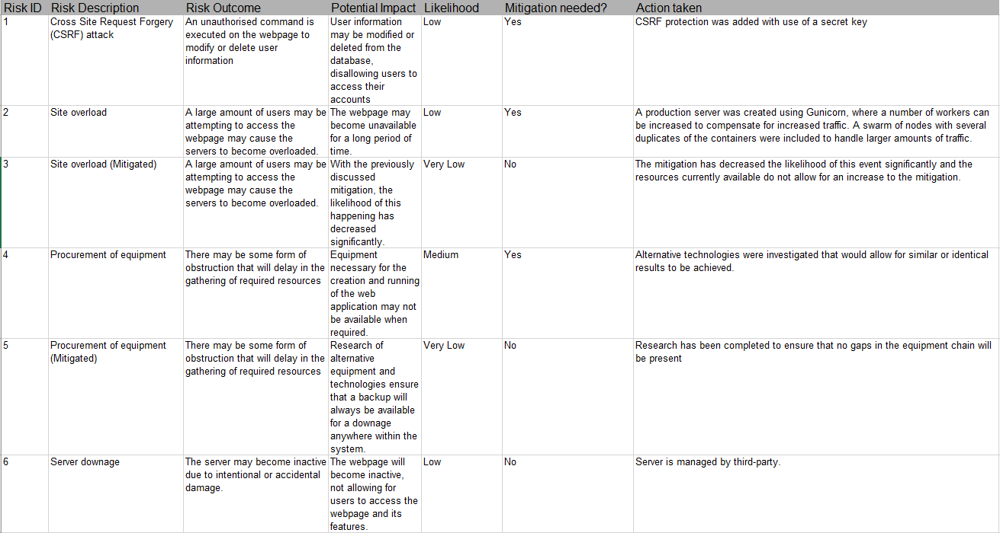
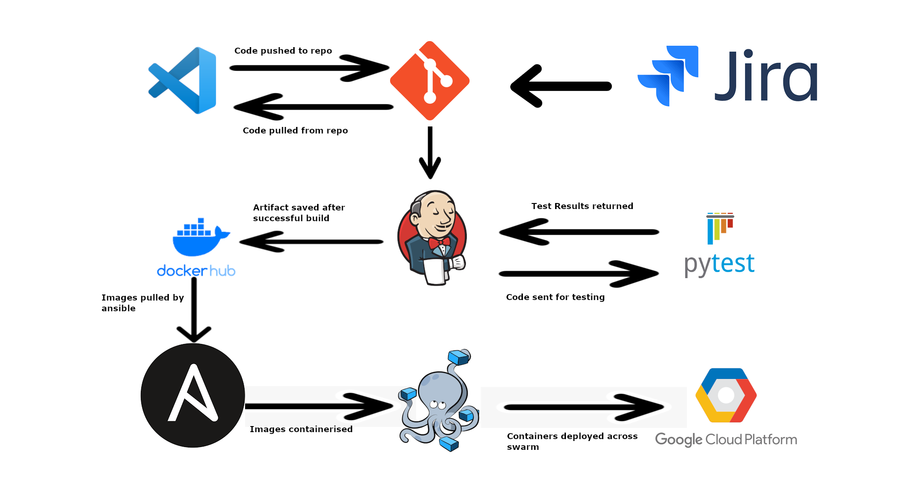

# QA-SFIA-2
## Planning
### Design of software
This project contained four services in its design at all stages of development, but the other containers found within the system differed across the design and creation process. Initially, each node which requires a connection to a MySQL database would be linked to its own unique database, the contents of which would be managed by a central database that no individual node would have access to. Although advantages were seen from a security stand point, the potential of incompatible data causing a system failure was exponentially higher.

A central SQL server was instead decided upon, with different tables accessible to the different services of the application, ensuring acceptable data would be imported. In addition, the use of a central database would mean less configuration and in turn decreased deployment time, improving the overall efficiency of the system. 
 

### Pipeline design 
For this project the necessary technologies were given in the project brief.
These technologies were:
- An Asana board
- Git
- Jenkins
- Ansible
- GCP Virtual Machines
- Docker
- Docker Swarm
- NGINX

### Risk Assessment
Before the creation of the project, a risk assessment was done to isolate all the potential risks that could effect the data stored on the local database, or the operation of the  system itself.
When a risk was mitigated, the risk was assessed once more with the added protection to measure the potential impact that the risk now possesses. 

## Creation
The web application is created using the python3 programming language, utilising the Flask framework for the handling of web services, HTML pages to display information in a user interface and Jinja2 to use logic on these on the previously mentioned web pages. 
Each service of the project was created individually, with an independant file structure created. For each service a dockerfile was created, enabling the specific service to be containerised without any negative effects on other services. 
The code was created using a feature-branch model on a github repository, with each new feature being created and tested before being merged into the main branch. 
A gitignore was created to avoid unneccesary files being uploaded to the repository, increasing the efficiency of commits to the repository and the cloning of the repository.

### Refactoring
Code was refactored in many areas as designs were changed and bug fixes neccessary. An example of this code refactoring was in relation to the service 2 and service 3 API's, with how they access the data they will then relay to the main service.
Originally, this information was stored in a list local to the API for the purpose of ensuring that the services were correctly functioning. As the design of the system was finalized to implement a central database, this code was edited to make use of this newly available resource. 

## Testing
Each service was tested individually with a coverage of 100% each. This ensured that all possible outcomes of the services were functioning as intended, with no unintended consequences from different results.
Each set of tests produced a report to provide more details in regard to the different tests that have taken place. 
Testing for the API's was completed by mocking the results obtained from a randomly generated number. This allowed for the assurance that even though the result was chosen randomly, the system would function as intended each time.

## System Integration and Build

### Jenkins CI Server
The central portion of the CI pipeline was the jenkins software, which was used to automate a set of tasks known as a pipeline. Builds are triggered by utilising a webhook, meaning that whenever a merge was made to the master branch a new build was triggered.
A pipeline was configured using a file known as "jenkinsfile" which laid out different stages of the build, and the steps which make up these stages. Each step consisted of a bash script in order to clean the code, and increase the ease of debugging any errors found within these scripts. 

The stages included in this pipeline were:
1) Installation and configuration of software in environment
2) Testing of the application
3) Exporting of required variables for deployment
4) Deployment of services across the swarm
5) Creation and storage of an artifact

At the end of a successful build, an artifact was created consisting of the images that were containerised and deployed across the swarm of nodes. These images were pushed to a dockerhub repository, allowing for them to accessed on other swarms with minimal interference.
In addition, the images were compressed to a tar file, available to be saved wherever is desired and loaded when required. 

### Ansible Configuration Management
The first stage of the pipeline was the configuration of the environment using the ansible software. This stage installed ansible, docker and docker-compose, and created a swarm containing a manager and worker node. 
Once ansible was installed, the software would then use a created playbook do determine what tasks would take place on what roles. 
The final piece of software installed in this stage of the jenkins pipeline is NGINX. A premade configuration file is then loaded to provide the intended behaviour.

### Docker Containerisation
The previously discussed docker files were used to create a self-contained environment for each service to function in. The services were then composed using the docker-compose software, creating a network for the nodes to communicate with each other while also allowing for communication with the user from a web browser. 

### Docker Swarm Orchestration
A group of virtual machines were used in conjunction as part of a swarm to handle large amounts of traffic. The previously discussed containers were deployed across this swarm with three replicas of each for the purpose of assisting in the larger amount of traffic. 
In addition, the use of a swarm allowed for rolling updates to be implemented, ensuring that there is no downtime from the perspective of the user as new versions of the software is added in turn to the nodes of the swarm. 

### NGINX Reverse Proxy
The NGINX web server was installed and configured to act as a reverse proxy for the application, easing the access of this application for the user. This reverse proxy allowed for the web app to be accessed with only the ip address of the relevant server, instead of requiring the ip address and the relevant port number, increasing accessibility and security.